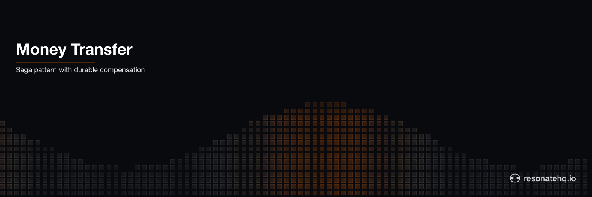

<p align="center">
  <picture>
    <source media="(prefers-color-scheme: dark)" srcset="./assets/banner-dark.png">
    <source media="(prefers-color-scheme: light)" srcset="./assets/banner-light.png">
    
  </picture>
</p>

# Money Transfer

**Resonate Rust SDK**

Move funds between two accounts as a saga — debit, credit, and on a credit-side failure, run a compensating debit-reversal. Each step is durable and idempotent, so a worker crash mid-transfer never leaves the ledger in a half-applied state.

## What this example demonstrates

- **Saga pattern.** A multi-step business operation written as straight-line Rust, with compensation triggered when a step fails.
- **Durable steps.** Each `ctx.run(...).await` call is a checkpoint. If the worker crashes after the debit but before the credit, Resonate replays from the last successful checkpoint.
- **Idempotency.** Ledger entries are keyed by a deterministic operation id (`{transfer_id}-debit`, `{transfer_id}-credit`, `{transfer_id}-reversal`) and inserted with `INSERT OR IGNORE`. Replays apply the entry once and only once.
- **Explicit compensation.** When the credit step returns an `Error`, the workflow catches it and runs the reversal — also durable, also idempotent.

## How the saga is wired

```text
                 transfer_money workflow
                        │
                        ▼
        ┌──────────────────────────────────┐
        │ 1. apply_entry  source  -amount  │   debit (checkpoint)
        └────────────────┬─────────────────┘
                         │
                         ▼
        ┌──────────────────────────────────┐
        │ 2. credit_target   target  amount│   credit (checkpoint)
        └────────────────┬─────────────────┘
                         │ on Err
                         ▼
        ┌──────────────────────────────────┐
        │ 3. apply_entry  source  +amount  │   compensating reversal
        └──────────────────────────────────┘
```

Each numbered box is a durable checkpoint. Steps 1 and 3 reuse the same `apply_entry` leaf — the difference is just the sign of the amount and the operation id.

## How to run

This example uses [Cargo](https://www.rust-lang.org/tools/install) as the build tool. After cloning, change directory into the project root.

Run the demo:

```shell
cargo run
```

You'll see two transfers: one happy path that commits, and one where the credit is configured to fail so the saga compensates. The closing balances show that `alice` is left correctly debited only by the committed transfer.

Sample output:

```text
opening balances: alice=200 bob=0

[saga] transfer transfer-001: alice -> bob  $50
  [ledger] transfer-001-debit: alice -50  // debit
  [ledger] transfer-001-credit: bob +50  // credit
[saga] transfer transfer-001 committed
result: TransferResult { transfer_id: "transfer-001", status: "committed", error: None }

[saga] transfer transfer-002: alice -> bob  $75
  [ledger] transfer-002-debit: alice -75  // debit
[saga] credit failed: application error: target account "bob" rejected the credit. Compensating...
  [ledger] transfer-002-reversal: alice +75  // reversal
result: TransferResult { transfer_id: "transfer-002", status: "compensated", error: Some("application error: ...") }

closing balances: alice=150 bob=50
```

## Running against a Resonate Server

The demo runs in **local mode** (`Resonate::local()`) — no server required, useful for iterating on the workflow itself.

For a server-backed deployment that survives process restarts, swap the constructor:

```rust
// Replace this:
let resonate = Resonate::local().with_dependency(Mutex::new(workflow_db));

// With this:
let resonate = Resonate::new(ResonateConfig {
    url: Some("http://localhost:8001".into()),
    group: Some("workers".into()),
    ..Default::default()
})
.with_dependency(Mutex::new(workflow_db));
```

Then start the Resonate server in a separate terminal:

```shell
brew install resonatehq/tap/resonate
resonate dev
```

## Files

- [`src/main.rs`](./src/main.rs) — the saga workflow, the SQLite ledger leaves, and a small demo driver.
- [`Cargo.toml`](./Cargo.toml) — pulls the Rust SDK as a `git` dependency from `main`.

## How it works

### Idempotent ledger entries

```rust
#[resonate::function]
async fn apply_entry(info: &Info, args: EntryArgs) -> Result<String> {
    let db = info.get_dependency::<Mutex<Connection>>();
    let conn = db.lock()...;
    conn.execute(
        "INSERT OR IGNORE INTO transfers (uuid, account, amount, note) \
         VALUES (?1, ?2, ?3, ?4)",
        params![args.op_id, args.account, args.amount, args.note],
    )?;
    Ok(args.op_id)
}
```

The `uuid` column is the table's primary key. `INSERT OR IGNORE` makes a replay of the same step a no-op — the row is already there, the balance already reflects it.

### The saga, written as straight-line code

```rust
#[resonate::function]
async fn transfer_money(ctx: &Context, args: TransferArgs) -> Result<TransferResult> {
    // Step 1 — debit (durable checkpoint).
    ctx.run(apply_entry, EntryArgs { /* -amount, "debit" */ }).await?;

    // Step 2 — credit (durable checkpoint).
    let credit_outcome = ctx
        .run(credit_target, CreditArgs { /* fail: ... */ })
        .await;

    // On credit failure, compensate by reversing the debit.
    if let Err(err) = credit_outcome {
        ctx.run(apply_entry, EntryArgs { /* +amount, "reversal" */ }).await?;
        return Ok(TransferResult { status: "compensated".into(), error: Some(err.to_string()), .. });
    }

    Ok(TransferResult { status: "committed".into(), .. })
}
```

The compensation path is just an `if let Err(...)` on the awaited `Result` — no exception machinery, no special framework hooks. The durability comes from the fact that each `ctx.run(...).await` creates a server-side promise that survives the process.

This saga's compensation IS the response to a credit-side failure. In production you'd typically allow a few retries first (network blips happen) and only compensate after the upstream has clearly rejected the credit.

### Account balances

Balances aren't stored — they're computed by summing the ledger:

```sql
SELECT COALESCE(SUM(amount), 0) FROM transfers WHERE account = ?
```

This makes the ledger the single source of truth. A reversal entry undoes a debit by adding the equivalent positive amount; the saga's correctness reduces to "the ledger reflects every committed step."

## Related

- [example-money-transfer-py](https://github.com/resonatehq-examples/example-money-transfer-py) — the Python port (same saga shape, single-file demo).
- [example-money-transfer-application-ts](https://github.com/resonatehq-examples/example-money-transfer-application-ts) — the TypeScript port (HTTP API + same saga shape).
- [Resonate Rust SDK](https://github.com/resonatehq/resonate-sdk-rs)
- [Resonate docs](https://docs.resonatehq.io)
